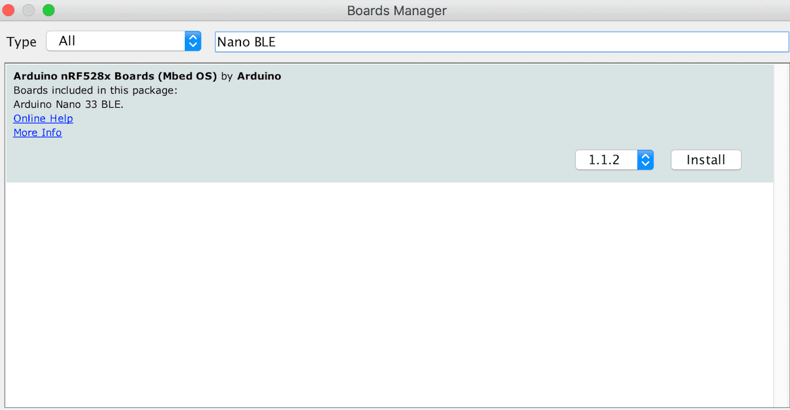
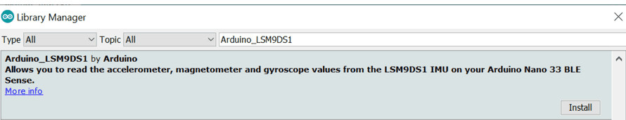
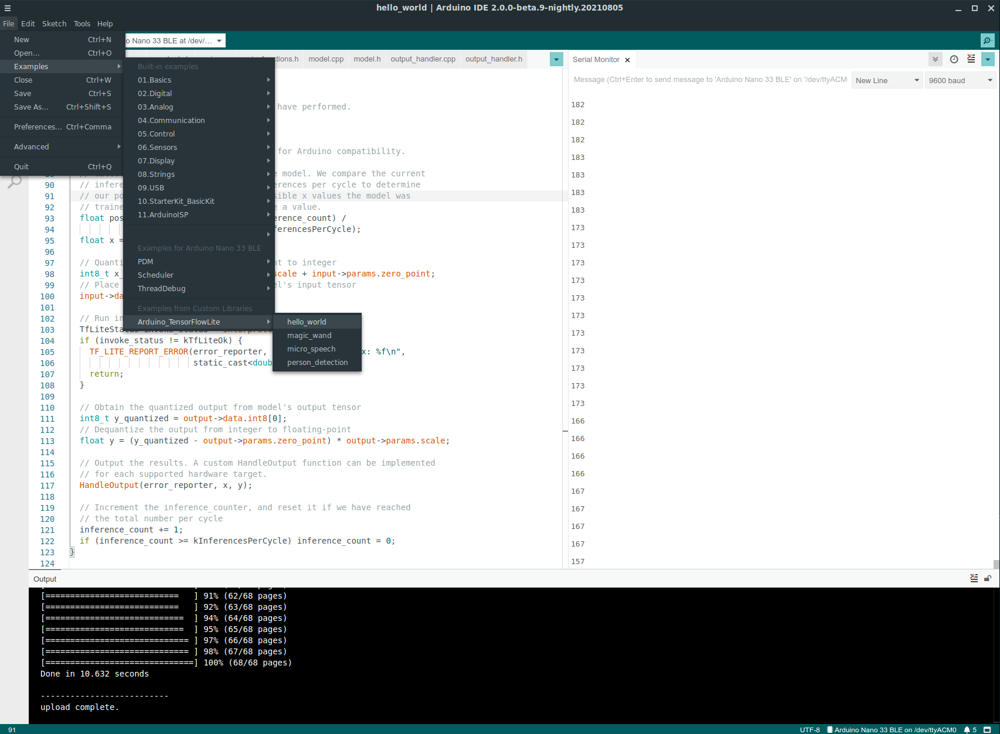
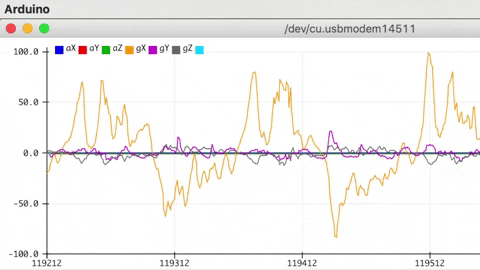
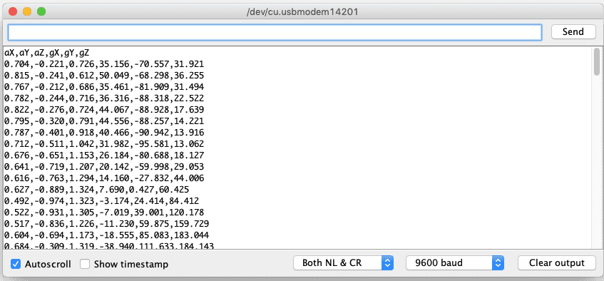
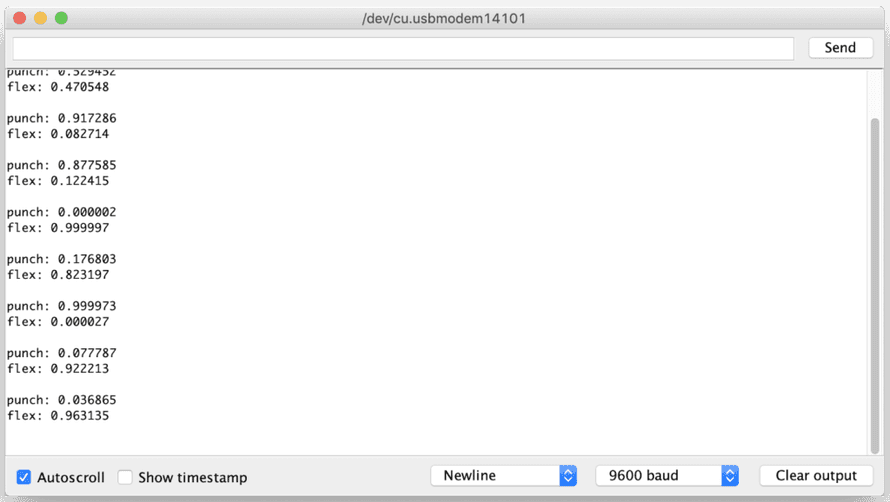

# Arduino Gesture Recognition using Tensorflow Lite

This project uses Arduino and TensorFlow to recognize the IMU Gestures , this document is an Guide to deploy your own Gesture Recognition micro controller using the code provided in this repository.

## Hardware Required
- Arduino Nano BLE 33 Sense Rev 2
- Mini USB Cable
- Computer

# Setup 
In this tutorial we will do everything locally thus we need to do some setup in our system , like installing some libraries and software. First lets start with installing [Arduino IDE](https://www.arduino.cc/en/software) , its recommended that you use the Version 1 for this tutorial (currently I was not able to copy generated data from the serial monitor in IDEv2) , next we need to install all the necessary drivers and libraries for BLE 33 

### Installing Drivers and Libraries 
To install the drivers, navigating to `Tools > Board > Board Manager...`, search for `Arduino Mbed OS Nano Boards`, and install it.

Now we will install `Arduino_BMI270_BMM150` which help us manage the IMU on the BLE board, to install this library navigating to **Tools > Manage libraries...**, search for ``Arduino_BMI270_BMM150``, and install it.

### Installing TensorFlow Lite  
As TensorFlow Lite is no longer available in the official Arduino Repository we need to manually install it form GitHub. For this navigate to TensorFlow's GitHub Repository by [clicking here](https://github.com/tensorflow/tflite-micro-arduino-examples) and download the ziped version of the Repository. 

Open the Arduino folder (usually in Home Directory in Linux) and navigate to `libraries` and unzip the file in that folder to install the TensorFlow Lite 

To conform the installation , open the Arduino IDE and navigate to `File>Examples` and there should be some examples for `Arduino_TensorFlowLite`.

# Generating Training Data 
Now we will generate training Data for both Punching and Flexing gestures. For this we will use the IMU on the BLE Sense Board to capture the data and print it in the serial monitor, after that we will copy that data into a `csv` file and use this data to train the ML model in the following steps. It is important that we have roughly the same data points for both gestures to prevent bias in the modal, practically it means that you might want to equal number of punches and flex gesture data points in the `csv` file. 

Lets start with uploading the `IMU_Data_Capture.ino` form the  repository to the BLE Sense board. 

## Visualizing the Data 
- In the Arduino IDE, open the Serial Plotter `Tools > Serial Plotter`
- If you get an error that the board is not available, reselect the port: `Tools > Port > portname (Arduino Nano 33 BLE)`
- Pick up the board and practice your punch and flex gestures
- You’ll see it only sample for a one second window, then wait for the next gesture
- You should see a live graph of the sensor data capture 

## Capturing the Data 
To capture data as a `csv` log to upload to TensorFlow, you can use `Arduino IDE > Tools > Serial Monitor` to view the data and export it to your desktop machine:

- Reset the board by pressing the small white button on the top
- Pick up the board in one hand (picking it up later will trigger sampling)
- In the Arduino IDE, open the `Serial Monitor Tools > Serial Monitor`
- If you get an error that the board is not available, reselect the port:
- `Tools > Port > portname (Arduino Nano 33 BLE)`
- Make a punch gesture with the board in your hand (Be careful whilst doing this!)
- Make the outward punch quickly enough to trigger the capture
- Return to a neutral position slowly so as not to trigger the capture again
- Repeat the gesture capture step 10 or more times to gather more data
- Copy and paste the data from the Serial Console to new text file called `punch.csv`
- Clear the console window output and repeat all the steps above, this time with a flex gesture in a file called `flex.csv`
- Make the inward flex fast enough to trigger capture returning slowly each time

**Note:** the first line of your two `csv` files should contain the fields `aX,aY,aZ,gX,gY,gZ`.

# Training the ML Model 
To train the ML Model open the `Arduino ML Gesture Reconization.ipynb` in Jupyter Notebook and follow the instructions in that notebook. But before that make sure that you have the `flex.csv` and `punch.csv` in the same directory.

By the end of this step you will have an `model.h` file that contains the TensorFlow Lite model in an Hexadecimal Array form that you can use in the Classification Code.

# Classifying IMU Data
Now we will upload the `MLGestureRecognition.ino` to the BLE Sense Board.

After uploading 
- Open the Serial Monitor: `Tools > Serial Monitor`
- Perform some gestures
- The confidence of each gesture will be printed to the Serial Monitor (0 = low confidence, 1 = high confidence)

